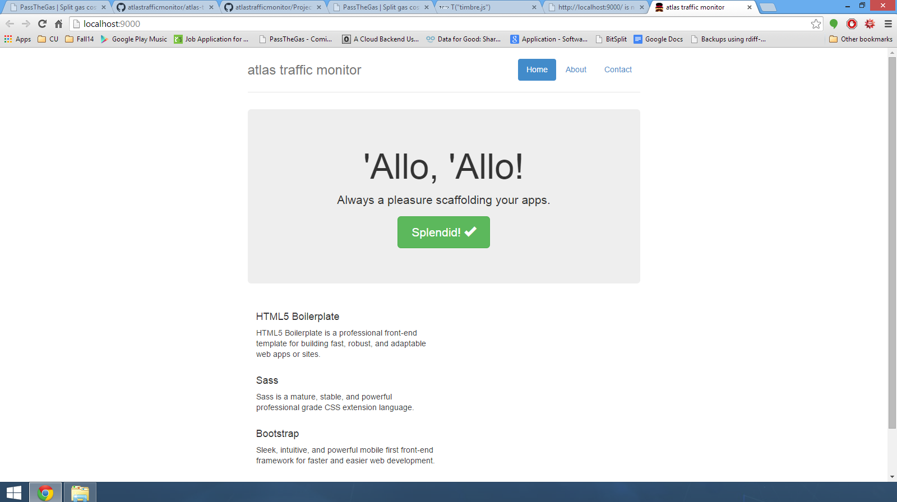

# Milestone Template

## Which Project?
[Project Organization (See client and server)](https://github.com/atlastrafficmonitor)

## Milestone Number
1 & 2

## Who Worked on this submission?
* Brian Newsom
* Ian Ker-Seymer
* Adrian Chen

## Describe what you're submitting
This submission includes the work by Brian and Ian towards the sound component of our project submission.

For milestone 1 we:
* Met up and picked a JS library for client side audio generation - [timbrejs](http://mohayonao.github.io/timbre.js) 
* Triggered simple sounds (jingle bells) from a key press and furthermore from a random websocket

For milestone 2 we:
* Delved further into Timbre and it's capabilities with sound

* Setup a server side Python application to be run on the RPi.  Since we don't have any hardware capabilities organized yet, we set this up as the interface - when we get information that someone has walked through the door, the application can send a websocket notification to the client application and play a noise.

* The noises are still sad - I've been working on this quite a bit but I've been struggling to make it work.  The library is not incredibly well documented.

For the hardware component, Adrian took the hardware with him over break and worked on Milestones 1 and 2.

Milestone 1:
* The hardware setup was completed, including setting up the raspberry pi.
* Had a basic code skeleton to check whether the sensors were functional.

Milestone 2:
* Wrote code for a basic counter to count the number of times the IR signal is interrupted. I would like to set this up on a larger scale, but did not have the means to do so over break.
* No screenshots as it was all performed on the arduino

## Code and Screenshots

Milestone 1:

* [Client Application](https://github.com/atlastrafficmonitor/atlas-traffic-client) --> As described above - plays a simple sound upon receiving notification through a websocket.
* Screenshots don't really make sense here, but to show we have a framework setup... 

Milestone 2:

* [Client Application](https://github.com/atlastrafficmonitor/atlas-traffic-client) --> Modified to receive from new server app.

* [Server Application](https://github.com/atlastrafficmonitor/atlas-traffic-server) --> As described above - communicates with client app through websockets and sends notification each second.

* [Messing with Effects (Not worth trying out yet)](https://github.com/atlastrafficmonitor/atlas-traffic-client/tree/effects) --> This is Brian trying to make the sound pretty - right now it's not working but I've spent quite a bit of time trying to get it there so I figured I'd include this branch.

* Audio based application = no screenshots.
