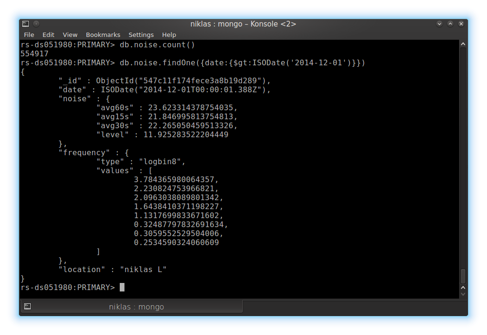
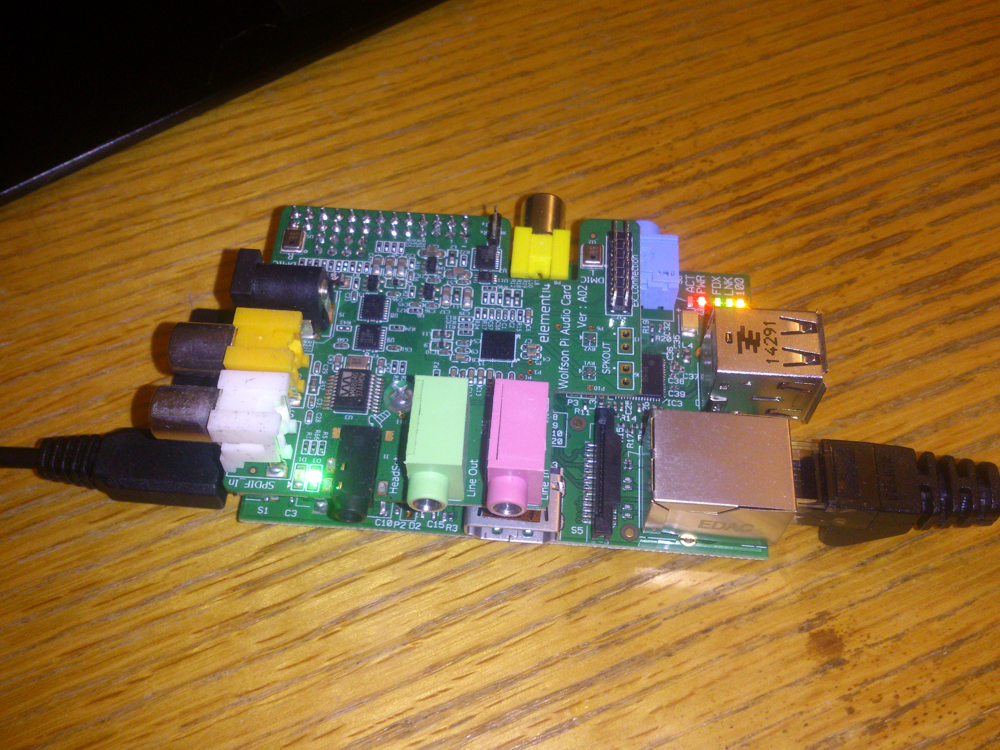

# Milestone Template

## Which Project?
[soundvisualizer](https://github.com/dawsonbotsford/soundvisualizer)

## Who Worked on this submission?
* Niklas Fejes

# Milestones for hardware part of project
1.  Get hardware from mike and set up that hardware
2.  Show that you are retrieving data and format it in a json string for sending over the wire.
3.  Send real data to jake and alex. 
4.  Live Demo. 

## Milestone Number
Hardware 1 and 2 done

## Describe what you're submitting
Submitting link to source code for the software that will run on the Raspberry Pi. In its current state the code will collect samples from three microphones and push to a mongodb server each other second.

Milestone 1 is done, except for that the microphones we will use in the final installation is not soldered or tested.

Milestone 2 is done, the device has so far pushed 554917 samples (280 MB) to a mongodb sever. (Ask me if you want the credentials.) Screenshots of sample queries are provided.

## Code and Screenshots
* [code link](https://github.com/dawsonbotsford/soundvisualizer/tree/master/noiserecorder) --> This is the source code for the noise recorder running on the Raspberry Pi. Documentation of format and brief explanation of how the code works is provided in the README.md.
*  --> This is a screenshot of mongodb queries.
*  --> Image of hardware setup.

